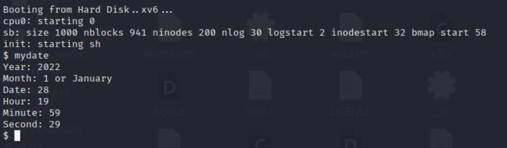

# Operating System 2 Programming Assignment 2
## Tanmay Garg CS20BTECH11063

- There are 2 files in the folder
    - xv6modified.tar.gz
    - ProgAsm2_CS20BTECH11063.pdf

- To compile and run the entire xv6 operating system

```
$ make
$ make qemu
```
- To run the first part of the assignment uncomment parts in ```syscall.c``` (mentioned in source code)
- To run the second part of the assignment comment parts in ```syscall.c``` (mentioned in source code)
- To make the second print time in UTC or IST follow instructions mentioned in source code ```mydate.c```
- The entire repository of xv6 has been cloned from the following github link
    - [xv6-public](https://github.com/mit-pdos/xv6-public.git)

- The following modifications have been made to make it work to print the name of system calls and to print the current date and time in both UTC and IST
- Part 1: To print the name of system calls
    - In ```syscall.c``` and inside the function ```syscall()``` for a valid systemcall,  ```cprintf()``` is used to print the name of the system call, the return value, and the pid
    - To print the name of system call, an array type implementation ```syscallsName``` is used which corresponds the system call number and returns the string containing the name of the system call
    - The return value of the system call is stored inside ```struct proc->tf->eax```
    - The value of pid is stored inside ```struct proc->pid```
- Part 2: To add a new system call which prints current date and time
    - In ```syscall.h``` the following changes are made
        - ```#define SYS_mydate 22``` is added
    - In ```syscall.c``` the following changes are made
        - ```extern int sys_mydate(void);``` is added which is an external system call defined elsewhere
        - ```[SYS_mydate]   sys_mydate``` is added inside ```static int (*syscalls[])(void)```
        - ```[SYS_mydate]   "date"``` is added inside ```static char (*syscallsName[])```
        - Inside ```sysproc.c``` a system call ```sys_mydate()``` is added to call ```cmostime()```
        - Inside ```user.h``` a function which would be called by user to print date and time is added, ```int mydate(struct rtcdate *r)```
        - Inside ```usys.S``` , ```SYSCALL(mydate)``` is added, so that the user can now call this function to print the date and time
        - Added ```_mydate``` to the ```UPROGS``` definition in ```Makefile```
        - A file ```mydate.c``` has been created which contains the required procedure to print the correct date and time of the system in UTC and IST format
- The working and design of the program:
    - To create a system call, we first should assign a system call number to our new system call 
    - When the user inputs the name of the system call in xv6, the console reads the name of the function and find the relevant number which corresponds to the function
     - A system call is executed in kernel mode as the program needs access low level functions
    - The program generates a trap
    - During a system call, the processor switches from user mode to kernel mode, then it completes the process and returns to user mode
    - Traps are handled in ```trapasm.S```  
    - The file makes a call ```trap(struct trapframe *)``` in ```trap.c```
    - A system call can also take arguments to kernel mode or take return value back to user mode
    - ```syscall.c``` stores an array of function pointers that return ```int```
    - There is a ```sys_``` prefix so that assembly instructions for each syscall are not written
    - A particular syscall takes ```eax``` register value that we placed on ```usys.S``` with its corresponding syscall number and then calls ```sys_<name of syscall>``` and puts the return value into ```eax``` register
    - When a user function is passed with any parameters, they are stored in the user stack and are accessed using ```argint``` ```argstr``` and ```argptr``` given in ```syscall.c```
    - Pointers to the memory location are passed to avoid unnecessary overhead

- Important Points to note
    - To use ```mydate``` call, first comment the first part of assignment (as mentioned in ```syscall.c```)
    - Enter ```mydate``` in the console and press ```Enter```
    - The current date and time will be printed in the console itself in either UTC or IST
    - To switch output time between UTC and IST, check ```mydate.c``` and make the appropriate changes need to made (mentioned in the source code)
    - An extra change has been made to the source in the file ```usertests.c``` at line 1461 to avoid the error 

    ```
    error: writing 1 byte into a region of size 0 [-Werror=stringop-overflow=]
    ```
    - The error might be due to different versions of compiler being used and the version of compiler used to develop xv6 in its original source

Here are some sample outputs that have been generated for both first part of the Assignment and second part of the Assignment

- Sample outputs



