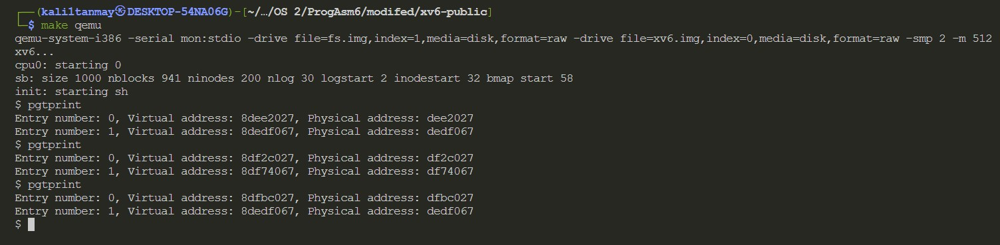
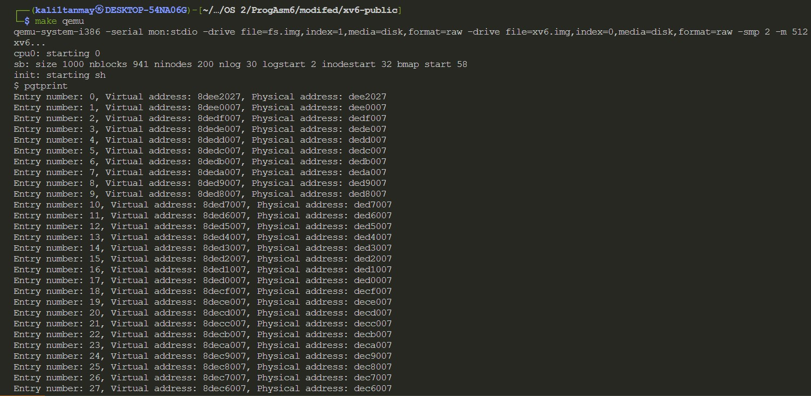
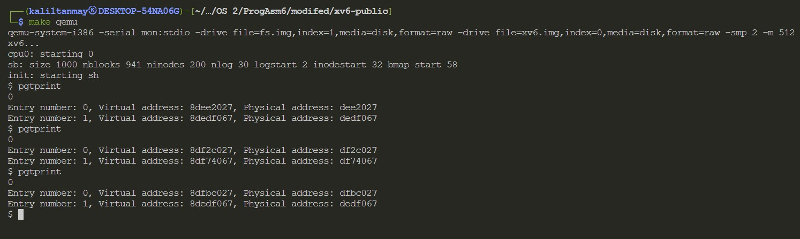
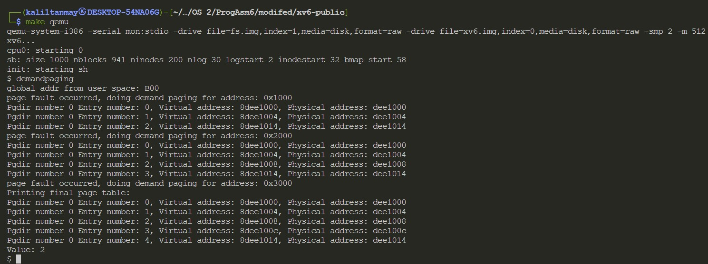

# Operating System 2 Programming Assignment 6
## Tanmay Garg CS20BTECH11063

- There are 2 files in the folder
    - xv6modified.tar.gz
    - Assn6_CS20BTECH11063_Report.pdf

- To compile and run the entire xv6 operating system

```
$ make
$ make qemu
```

To run ```pgtprint function ```
```
$ pgtprint
```
To run ```demandpaging```
```
$ demandpaging
```
- The entire repository of xv6 has been cloned from the following github link
    - [xv6-public](https://github.com/mit-pdos/xv6-public.git)

- To add a new system call which prints current date and time
    - In ```syscall.h``` the following changes are made
        - ```#define SYS_pgtprint 23``` is added
    - In ```syscall.c``` the following changes are made
        - ```extern int sys_pgtprint(void); ``` is added which is an external system call defined elsewhere
        - ```[SYS_pgtprint]   sys_pgtprint``` is added inside ```static int (*syscalls[])(void)```
        - Inside ```sysproc.c``` a system call ```sys_pgtprint()``` is added to print page table entires
        - Inside ```user.h``` a function which would be called by user to print date and time is added, ```int pgtprint()```
        - Inside ```usys.S``` , ```SYSCALL(pgtprint)``` is added, so that the user can now call this function to print the date and time
        - Added ```_pgtprint``` to the ```UPROGS``` definition in ```Makefile```
        - A file ```pgtprint.c``` has been created which calls ```pgtprint()``` to print the page tables

- The working and design of the program:
    - To create a system call, we first should assign a system call number to our new system call 
    - When the user inputs the name of the system call in xv6, the console reads the name of the function and find the relevant number which corresponds to the function
     - A system call is executed in kernel mode as the program needs access low level functions
    - The program generates a trap
    - During a system call, the processor switches from user mode to kernel mode, then it completes the process and returns to user mode
    - Traps are handled in ```trapasm.S```  
    - The file makes a call ```trap(struct trapframe *)``` in ```trap.c```
    - A system call can also take arguments to kernel mode or take return value back to user mode
    - ```syscall.c``` stores an array of function pointers that return ```int```
    - There is a ```sys_``` prefix so that assembly instructions for each syscall are not written
    - A particular syscall takes ```eax``` register value that we placed on ```usys.S``` with its corresponding syscall number and then calls ```sys_<name of syscall>``` and puts the return value into ```eax``` register
    - When a user function is passed with any parameters, they are stored in the user stack and are accessed using ```argint``` ```argstr``` and ```argptr``` given in ```syscall.c```
    - Pointers to the memory location are passed to avoid unnecessary overhead

- Important Points to note
    - To use pgtprint call, enter ```pgtprint``` in the console and press Enter
    - The entire page table entry will be printed as per requirements mentioned in the assignment

Here are some of the sample outputs for various situations as mentioned in the assignment
- Normal pgtprint without any arrays



- pgtprint with ```int arrGlobal[100000];```



- pgtprint with ```int arrLocal[100000];```



In the case of using local array the pagetable printing does not change while in the case of using global array we can see that many pagetable entries are being printed

In the case of global variables values were assigned statically on compile time and in the case of local variables it is assigned on the heap dynamically

### Assignment part 2
The following changes have been made for part 2 of the assignment
- ```exec.c```
    - ```if((sz = allocuvm(pgdir, sz, ph.vaddr + ph.filesz)) == 0) ```
    - ```sz += ph.memsz - ph.filesz;```
    - The above changes have been made at line 54-70
- ```trap.c```
    - switch case for ```T_PGFLT``` has been added at line 80
    - The code has been taken from ```allocuvm``` function
- ```demandpaging.c```
    - The following file has been added to give user program functionality
- ```defs.h```
    - ```int             map_to_page(pde_t *pgdir, void *va, uint size, uint pa, int perm);```
    - The declaration of function has been made in the file to map memory to pages
- ```vm.c```
    - ```int map_to_page(pde_t *pgdir, void *va, uint size, uint pa, int perm)```
    - This function is same as ```mapppages```
    - Both the functions are exactly same
- Added ```_demandpaging``` to the ```UPROGS``` definition in ```Makefile```

- Working and Design of the code
    - The changes in ```exec.c``` does not allocate memory to dynamic variables when calling ```allocuvm``` but ```sz``` is still same as before
    - Then when the program gets a trap or a page fault occurs
    - It goes into page fault case in ```trap.c```
    - It gets the address of the register where the page fault has occured
    - It then assigns memory, if it able to allocate, then it does ```memset```
    - It then maps the page to physical and virtual memory and then continues with the program

Here are some of the sample outputs for ```demandpaging``` in the operating system



The above assignment has been done with discussion with Dr. Rajesh Kedia (course instructor) and collaboration with students for page fault creation. Their roll numbers and names are:
- Aayush Patel CS20BTECH11001
- Vikhyath CS20BTECH11056


The following are some of the references used to solve the assignment
- [https://pdos.csail.mit.edu/6.828/2017/homework/xv6-zero-fill.html](https://pdos.csail.mit.edu/6.828/2017/homework/xv6-zero-fill.html)
- [https://oslab.kaist.ac.kr/wp-content/uploads/esos_files/courseware/undergraduate/UKD/homework/homework04.pdf](https://oslab.kaist.ac.kr/wp-content/uploads/esos_files/courseware/undergraduate/UKD/homework/homework04.pdf)
- [https://pdos.csail.mit.edu/6.828/2008/lec/l5.html](https://pdos.csail.mit.edu/6.828/2008/lec/l5.html)
- [https://www.cs.virginia.edu/~cr4bd/4414/F2018/paging-and-protection.html#tocAnchor-1-3](https://www.cs.virginia.edu/~cr4bd/4414/F2018/paging-and-protection.html#tocAnchor-1-3)
- [https://www.cs.columbia.edu/~junfeng/11sp-w4118/lectures/exec.pdf](https://www.cs.columbia.edu/~junfeng/11sp-w4118/lectures/exec.pdf)
- [https://www.cse.iitd.ac.in/~sbansal/os/previous_years/2011/xv6-book/mem.pdf](https://www.cse.iitd.ac.in/~sbansal/os/previous_years/2011/xv6-book/mem.pdf)

### Note
- The above results may differ based on the oeprating system xv6 is run on
- It may also depend on the version of xv6 using and the architecture on which it is running
- The address printed where page fault occured is the address got from ```rcr2()```
