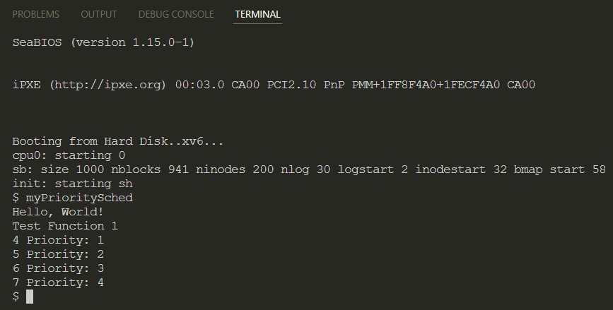
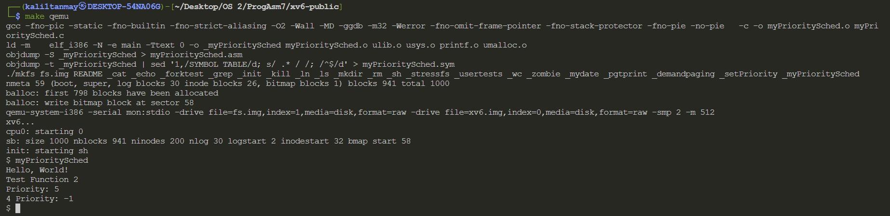

# Operating System 2 Programming Assignment 7
## Tanmay Garg CS20BTECH11063

- There are 2 files in the folder
    - xv6modified.tar.gz
    - Assn7_CS20BTECH11063_Report.pdf

- To compile and run the entire xv6 operating system

```
$ make
$ make qemu
```

To run user program ```myPrioritySched.c ```
```
$ myPrioritySched
```

- The entire repository of xv6 has been cloned from the following github link
    - [xv6-public](https://github.com/mit-pdos/xv6-public.git)

- To add a new system call which sets priority of a process
    - In ```syscall.h``` the following changes are made
        - ```#define SYS_setPriority 24``` is added
    - In ```syscall.c``` the following changes are made
        - ```extern int sys_setPriority(void); ``` is added which is an external system call defined elsewhere
        - ```[SYS_setPriority]   sys_setPriority``` is added inside ```static int (*syscalls[])(void)```
        - Inside ```sysproc.c``` a system call ```sys_setPriority()``` is added to print page table entires
        - Inside ```user.h``` a function which would be called by user to print date and time is added, ```int setPriority(int priority)```
        - Inside ```usys.S``` , ```SYSCALL(setPriority)``` is added, so that the user can now call this function to print the date and time
        - Added ```_setPriority\``` to the ```UPROGS``` definition in ```Makefile```
        - A file ```setPriority.c``` has been created

- The working and design of the program:
    - To create a system call, we first should assign a system call number to our new system call 
    - When the user inputs the name of the system call in xv6, the console reads the name of the function and find the relevant number which corresponds to the function
     - A system call is executed in kernel mode as the program needs access low level functions
    - The program generates a trap
    - During a system call, the processor switches from user mode to kernel mode, then it completes the process and returns to user mode
    - Traps are handled in ```trapasm.S```  
    - The file makes a call ```trap(struct trapframe *)``` in ```trap.c```
    - A system call can also take arguments to kernel mode or take return value back to user mode
    - ```syscall.c``` stores an array of function pointers that return ```int```
    - There is a ```sys_``` prefix so that assembly instructions for each syscall are not written
    - A particular syscall takes ```eax``` register value that we placed on ```usys.S``` with its corresponding syscall number and then calls ```sys_<name of syscall>``` and puts the return value into ```eax``` register
    - When a user function is passed with any parameters, they are stored in the user stack and are accessed using ```argint``` ```argstr``` and ```argptr``` given in ```syscall.c```
    - Pointers to the memory location are passed to avoid unnecessary overhead

The problem with such an implementation is that an invalid priority can be given to a process, for this we can keep a safety check and not change the priority if the priority is invalid such as being out of bounds. A system call can purposely change the priority of a process when not required

```
I have taken priority 0 as the highest priority process
```

### Assignment part 2
The following changes have been made for part 2 of the assignment
- ```proc.c```
    - In the function ```scheduler()``` our own implimentation of round-robin has been implemented
- ```myPrioritySched.c```
    - Test cases for round robin scheduling
- Added ```_myPrioritySched``` to the ```UPROGS``` definition in ```Makefile```

There are 2 test cases written in ```myPrioritySched.c```
- The first test case is for forking multiple child processes and then applying round robin



- The second test case is for giving invalid priority number to child process



The problem is that starvation can occur if lower priority proceses are contionusly being requested. In order to mitigate this, we can add an ```ageing``` method, which will increase priority after a certain threshold


### Note
- The above results may differ based on the oeprating system xv6 is run on
- It may also depend on the version of xv6 using and the architecture on which it is running

